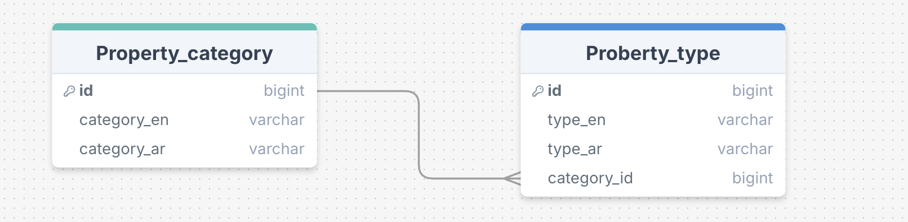
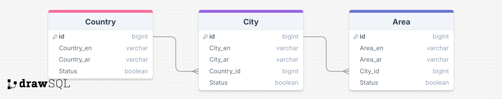

# RealState API 
# 📄 Property Type Database Table Structure
This document outlines the structure of the **Property Classification** portion of the database, consisting of two related tables:

- `Property_Category`
- `Property_Type`
## 🏘️ Property Database Chart

---
### 📂 Property_Category Table

| Column        | Type    | Description                        |
|---------------|---------|------------------------------------|
| `id`          | int     | Primary key, auto-incremented.     |
| `category_en` | string  | Category name in English.          |
| `category_ar` | string  | Category name in Arabic.           |

---

### 🏷️ Property_Type Table

| Column     | Type    | Description                                                               |
|------------|---------|---------------------------------------------------------------------------|
| `id`       | int     | Primary key, auto-incremented.                                            |
| `type_en`  | string  | Property type name in English.                                            |
| `type_ar`  | string  | Property type name in Arabic.                                             |
| `category_id` | int  | Foreign key referencing `Property_Category.id`, links type to a category. |

# 📄 Location Database Table Structure
---
This project includes a structured database of **Countries**, **Cities**, and **Areas**, designed with clarity and integrity using foreign key relationships. Below is a detailed explanation of each table and its columns.

---
## Database Chart

---

## 🌍 Country Table

| Column Name   | Description                                                                 |
|---------------|-----------------------------------------------------------------------------|
| `id`          | Unique identifier for each country (Primary Key).                           |
| `country_en`  | Country name written in English.                                             |
| `country_ar`  | Country name written in Arabic.                                              |
| `status`      | Indicates whether the country is active (`1`) or inactive (`0`). Used instead of deletion. |

---

## 🏙️ City Table

| Column Name   | Description                                                                 |
|---------------|-----------------------------------------------------------------------------|
| `id`          | Unique identifier for each city (Primary Key).                              |
| `city_en`     | City name written in English.                                               |
| `city_ar`     | City name written in Arabic.                                                |
| `country_id`  | Foreign key referencing the `Country` table (`Many-to-One` relationship).   |
| `status`      | Indicates whether the city is active (`1`) or inactive (`0`).              |

---

## 📍 Area Table

| Column Name   | Description                                                                 |
|---------------|-----------------------------------------------------------------------------|
| `id`          | Unique identifier for each area (Primary Key).                              |
| `area_en`     | Area name written in English.                                               |
| `area_ar`     | Area name written in Arabic.                                                |
| `city_id`     | Foreign key referencing the `City` table (`Many-to-One` relationship).      |
| `status`      | Indicates whether the area is active (`1`) or inactive (`0`).              |

---

